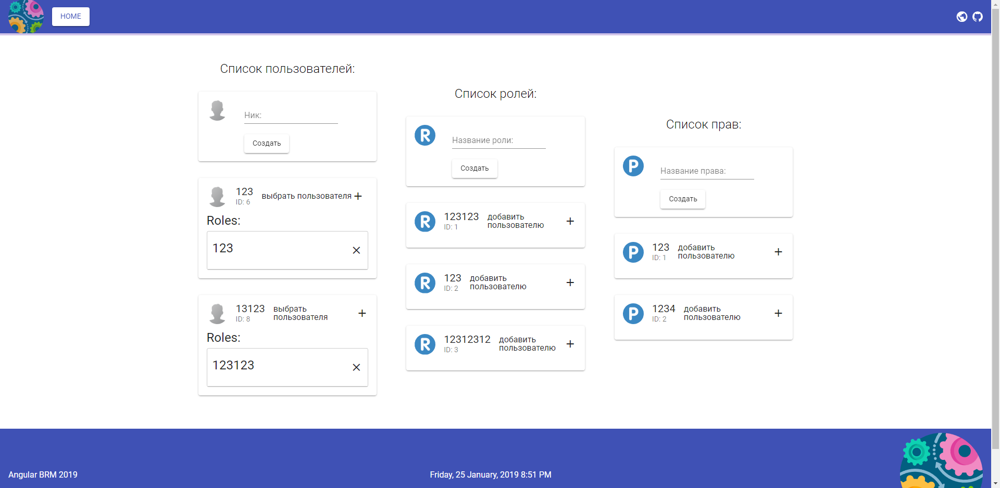

<p align="center">
  <h3 align="center">Angular BRM App</h3>
</p>




## Quick start

**Warning**

> Verify that you are running at least node 8.9.x and npm 5.x.x by running node -v and npm -v in a terminal/console window. Older versions produce errors, but newer versions are fine.

1. Go to project folder and install dependencies.

```bash
npm i
```

2. Launch development server:

```bash
npm start
```

**Note**

> You don't need to build the example library because it's published in npm and added as dependency of the project.

## Commands

| Tasks                 | Description                                                                                  |
| --------------------- | -------------------------------------------------------------------------------------------- |
| npm i                 | Install dependencies                                                                         |
| npm start             | Start the app in development mode                                                            |
| npm run test          | Run unit tests with karma and jasmine                                                        |
| npm run e2e           | Run end to end tests with protractor                                                         |
| npm run build         | Build the app for production                                                                 |
| npm run build:library | Build the library                                                                            |
| npm run lint          | Run the linter (tslint)                                                                      |
| npm run ci            | Execute linter and tests                                                                     |
| npm run extract       | Generate all json files with the translations in assets folder                               |
| npm run translate     | Translate all keys remaining using Google Translate and using English language as the origin |
| npm run deploy        | Build the app and deploy it to firebase hosting                                              |
| npm run bundle-report | Build and run webpack-bundle-analyzer over stats json                                        |
| npm run release       | Create a new release using standard-version                                                  |
| npm run docker        | Build the docker image and run the container                                                 |
| npm run update        | Update the project dependencies with ng update                                               |

### Prerequisites

This project require [BRM-back-end-Net-Core-2](https://github.com/DeltaImpact/BRM-back-end-Net-Core-2) as the backend.

### Acknowledgments

- This project based on [angular7-example-app](https://github.com/Ismaestro/angular7-example-app)
- Used Icon made by [Freepik](http://www.freepik.com/) from www.flaticon.com

## Copyright and license

Code and documentation copyright 2018 the authors. Code released under the [MIT License](https://github.com/Ismaestro/angular7-example-app/blob/master/LICENSE).
